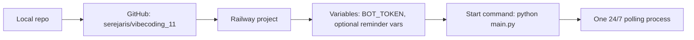

# AGENTS.md

## Purpose And Scope

- This repository contains SubTrack, a Telegram bot for tracking recurring subscriptions in USD.
- Keep product decisions in `PRD.md`.
- Keep technical operation rules in this file.
- Keep user-facing quickstart and lesson handoff in `README.md`.

## Canonical Paths Or Services

- `main.py` — application entrypoint.
- `bot/handlers.py` — Telegram commands, message handlers, callback handlers, FSM flows.
- `bot/database.py` — SQLite schema and data access.
- `bot/reminders.py` — background reminder loop.
- `bot/formatters.py` — amount, date, period, list, stats, and card formatting.
- `bot/keyboards.py` — reply and inline keyboards.
- `bot/states.py` — FSM state definitions.
- `tests/` — unit tests for database behavior and formatting logic.
- `data/subscriptions.db` — local SQLite runtime database, ignored by git.
- `.env` — local secrets, ignored by git.
- `.env.example` — public list of required env var names.
- GitHub repo: `https://github.com/serejaris/vibecoding_11`.
- Target 24/7 deploy surface: Railway, deployed from the GitHub repo.

## System Boundaries

- This is a long-polling Telegram bot, not a webhook service.
- The bot must run as exactly one active process per Telegram bot token.
- Local development uses `.venv/bin/python main.py`.
- Railway production should use `python main.py` as the start command.
- The current database is SQLite. Do not introduce PostgreSQL or migrations unless the user asks for a production storage upgrade.
- Product scope is personal subscription tracking in USD only.

## Safe Defaults

- Use Python already present in `.venv` when available.
- Use `unittest`, not `pytest`, unless pytest is intentionally added as a dependency.
- Do not print, commit, paste, or summarize real token values.
- Keep `.env`, `data/*.db`, `logs/`, `.venv/`, `__pycache__/`, `.DS_Store`, and `*.py[cod]` out of git.
- Keep the bot text in Russian and concise.
- Keep all money display in USD with `$`.
- Prefer small edits in the existing `aiogram 3` architecture.

## Libraries And Technologies

- Runtime language: Python 3.13 locally; Python 3.11+ is acceptable if dependencies install cleanly.
- Telegram framework: `aiogram==3.20.0`.
- Database: SQLite through `aiosqlite==0.21.0`.
- Env loading: `python-dotenv==1.1.0`.
- Scheduling: in-process `asyncio` reminder loop.
- Telegram mode: long polling through `Dispatcher.start_polling`.
- Parse mode: HTML.

## Environment Variables

Required:

- `BOT_TOKEN` — Telegram bot token from BotFather.

Optional:

- `REMIND_DAYS_BEFORE` — first reminder offset in days, default `3`.
- `REMINDER_INTERVAL_SECONDS` — reminder loop interval, default `3600`.

Rules:

- `.env.example` may contain variable names and placeholders only.
- Real `BOT_TOKEN` values belong in local `.env` or Railway variables.
- Rotate the token if it is ever committed or pasted into a public place.

## Deploy

Target deploy path:



Railway setup:

- Source: GitHub repo `serejaris/vibecoding_11`.
- Start command: `python main.py`.
- Required variables: `BOT_TOKEN`.
- Optional variables: `REMIND_DAYS_BEFORE`, `REMINDER_INTERVAL_SECONDS`.

Before enabling Railway polling, stop the local `python main.py` process that uses the same token.

## Allowed Actions

- Edit product documentation in `PRD.md`.
- Edit technical instructions in `AGENTS.md`.
- Edit quickstart and lesson-facing notes in `README.md`.
- Modify bot handlers, formatters, keyboards, reminders, and database code.
- Add focused unit tests in `tests/`.
- Run local tests and local bot startup checks.
- Commit and push documentation or code changes when the user asks for it.

## Confirmation-Required Actions

- Changing GitHub repository visibility.
- Pushing to GitHub unless the user has asked for push in the current task.
- Deploying or redeploying Railway.
- Stopping an existing bot process if the user did not ask to change runtime state.
- Rotating or regenerating the Telegram token.
- Deleting or rewriting `data/subscriptions.db`.
- Changing storage from SQLite to another database.

## Forbidden Actions

- Do not commit `.env` or real tokens.
- Do not log secrets.
- Do not run two polling processes with the same Telegram token intentionally.
- Do not add currency choice unless the PRD changes.
- Do not add web UI, bank integrations, email parsing, or receipt parsing without explicit product approval.
- Do not claim Railway production is live unless it was verified after deploy.

## Validation Commands

```bash
.venv/bin/python -m unittest discover -s tests -v
git diff --check
git status --short
```

Optional startup check:

```bash
.venv/bin/python main.py
```

Use the startup check only when a valid local `.env` is present. Stop the local process after verification unless the user asked to keep it running.

## Execution Contract

- Start by identifying whether the change is product (`PRD.md`), technical (`AGENTS.md`), user-facing (`README.md`), or code.
- Before editing runtime code, read the relevant current module.
- After editing code, run the unit tests.
- After editing Markdown only, run `git diff --check`; run unit tests too if commands, runtime, or behavior claims changed.
- Before saying "deployed", verify the actual Railway runtime or explicitly state that deploy was not verified.
- Before pushing, show or check the scoped diff and make sure secrets are not included.

## References

- `README.md`
- `PRD.md`
- `.env.example`
- `requirements.txt`
