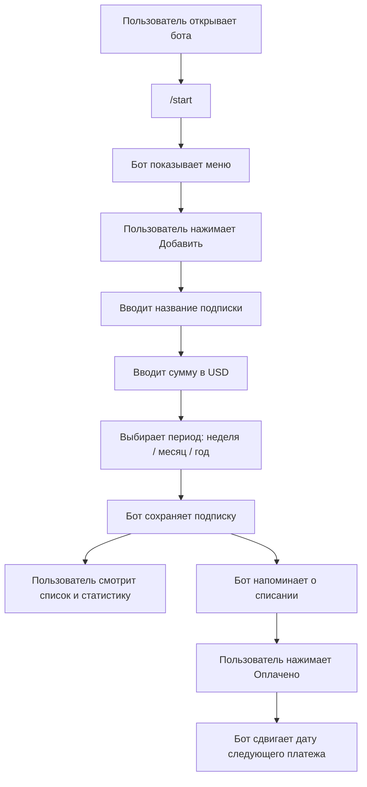
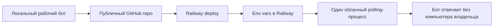

# PRD: SubTrack

## Коротко

SubTrack — персональный Telegram-бот для учета регулярных подписок в USD. Пользователь добавляет сервисы, видит примерную месячную нагрузку, ближайшие списания и получает напоминания заранее.

Telegram: [@ris_subtrack_bot](https://t.me/ris_subtrack_bot)

## Проблема

Подписки разбросаны по разным сервисам, картам и датам списания. Пользователь легко забывает, когда платить, сколько уходит в месяц и какие подписки пора отменить.

## Целевая аудитория

Взрослый пользователь Telegram, который сам платит за цифровые сервисы: стриминг, VPN, облака, AI-инструменты, SaaS и софт. Главный контекст использования — короткие сессии в мобильном Telegram.

## Ценность

- Один список всех подписок.
- Понимание примерной суммы в месяц.
- Видимость ближайших списаний.
- Напоминания до платежа.
- Быстрое обновление даты после оплаты.

## Текущий статус продукта

- Бот реализован как рабочий MVP.
- Код лежит в публичном GitHub-репозитории: <https://github.com/serejaris/vibecoding_11>.
- Бот умеет работать локально через long polling.
- Целевой следующий шаг — запуск 24/7 на Railway.
- До production-деплоя в Railway локальный процесс остается dev/runtime способом запуска.

## Главный пользовательский сценарий

## Функции MVP

### Первый запуск

Пользователь отправляет `/start`. Бот объясняет, что помогает вести подписки в USD, и показывает главное меню.

### Добавление подписки

Пользователь вводит:

1. Название подписки.
2. Сумму в USD.
3. Период списания: еженедельно, ежемесячно или ежегодно.

Дата следующего списания считается автоматически: сегодня + выбранный период.

### Список подписок

Команда `/list` показывает все подписки пользователя:

- название;
- сумма;
- период;
- дата следующего списания;
- сколько дней осталось;
- примерная стоимость в месяц.

Срочность отмечается цветом:

- зеленый — больше 7 дней;
- желтый — 4-7 дней;
- красный — 3 дня или меньше.

### Статистика

Команда `/stats` показывает:

- примерную общую сумму в месяц;
- ближайшие списания на 30 дней.

Недельные и годовые подписки приводятся к месячной сумме.

### Изменение даты

Команда `/date` позволяет выбрать подписку и вручную задать дату следующего списания.

Формат даты: `15.06.2026`.

### Удаление

Команда `/delete` позволяет выбрать подписку и удалить ее из учета.

### Напоминания

Бот отправляет напоминания:

- за `REMIND_DAYS_BEFORE` дней до списания;
- за 1 день до списания;
- в день списания.

Повторное напоминание за ту же дату и тот же offset не дублируется.

### Оплата

В напоминании есть кнопка `Оплачено`. После нажатия бот сдвигает дату следующего платежа на период подписки.

## Команды

| Команда | Действие |
|---|---|
| `/start` | Приветствие и главное меню |
| `/help` | Список команд |
| `/add` | Добавить подписку |
| `/list` | Показать подписки |
| `/stats` | Показать месячную статистику |
| `/date` | Изменить дату следующего списания |
| `/delete` | Удалить подписку |

## Основные ограничения

- Валюта только USD.
- Нет банковской интеграции.
- Нет автоматического чтения чеков, email или выписок.
- Нет веб-интерфейса.
- Нет командной работы и семейного бюджета.
- Бот не дает финансовых советов.

## Критерии готовности

- Бот отвечает на `/start`.
- Пользователь может добавить подписку без ручного ввода даты.
- Пользователь видит список подписок.
- Пользователь видит месячную сумму.
- Пользователь может изменить дату списания.
- Пользователь может удалить подписку.
- Напоминания не дублируются.
- Кнопка `Оплачено` сдвигает дату следующего платежа.
- Данные пользователя не смешиваются с данными другого Telegram-аккаунта.
- После перезапуска процесса данные сохраняются.

## Следующая версия

Цель следующего шага — сделать SubTrack сервисом 24/7:

Для этого нужно деплоить текущий репозиторий на Railway, перенести `BOT_TOKEN` в Railway variables и остановить локальный polling-процесс с тем же токеном.
