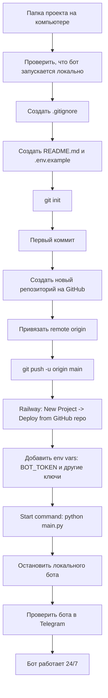

# SubTrack

Локальный MVP Telegram-бота для трекинга подписок.

**Связка:** Кружок Вайбкодинга, поток #11, урок 2 — агентный режим, Telegram-боты и локальный запуск через Codex/Cursor.

## Что внутри

- `aiogram 3` бот с командами `/start`, `/add`, `/list`, `/stats`, `/date`, `/delete`
- SQLite база `data/subscriptions.db`
- напоминания через локальный `asyncio` loop
- суммы только в USD
- тесты для форматирования, дат, расчётов и SQLite-слоя

## Запуск

```bash
cp .env.example .env
# вставить BOT_TOKEN в .env
source .venv/bin/activate
python main.py
```

## Проверка

```bash
.venv/bin/python -m unittest discover -s tests -v
```

## Если репозитория ещё нет



Минимальный порядок действий:

1. Убедиться, что бот отвечает локально.
2. Проверить, что `.env` добавлен в `.gitignore`.
3. Оставить в `.env.example` только имена переменных без настоящих значений.
4. Создать репозиторий на GitHub и запушить код.
5. Подключить GitHub repo в Railway.
6. Добавить переменные окружения в Railway.
7. Остановить локальный процесс перед облачным запуском.
8. Проверить бота в Telegram.

## Важно

MVP рассчитан на локальный Mac: пока процесс не запущен, бот не отвечает и не шлёт напоминания.
